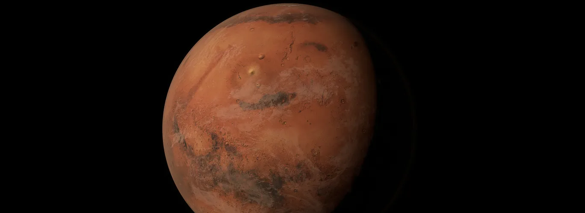

# Mars_WebScraping

Used Python application and BeautifulSoup to iterate through multiple sources, scrape data and images pertaining to Mars, and presented collected data in an HTML webpage.
Scraped using Python, Chromedriver, BeautifulSoup
Flask application connected to MongoDB
Used Jupyter Notebook to clean data
Sites scraped:
NASA Mars News: https://mars.nasa.gov/news/?page=0&per_page=40&order=publish_date+desc%2Ccreated_at+desc&search=&category=19%2C165%2C184%2C204&blank_scope=Latest
JPL Mars Space Featured Images: https://www.jpl.nasa.gov/spaceimages/?search=&category=Mars
Mars Facts: https://space-facts.com/mars/
Mars Hemisphere Data: https://astrogeology.usgs.gov
